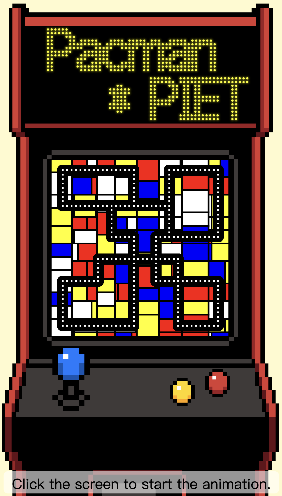
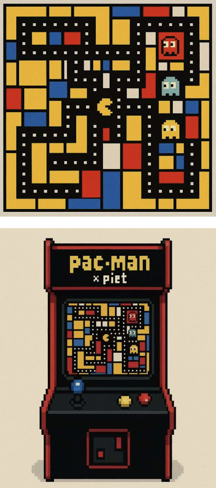
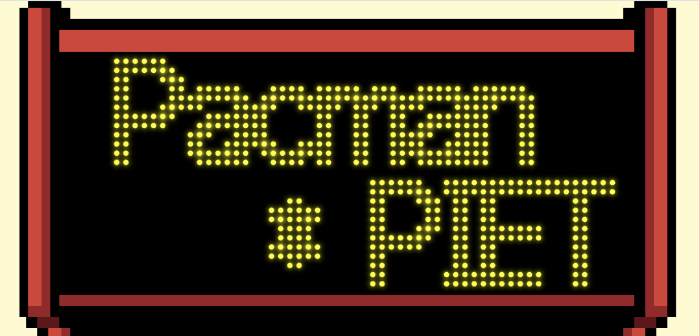
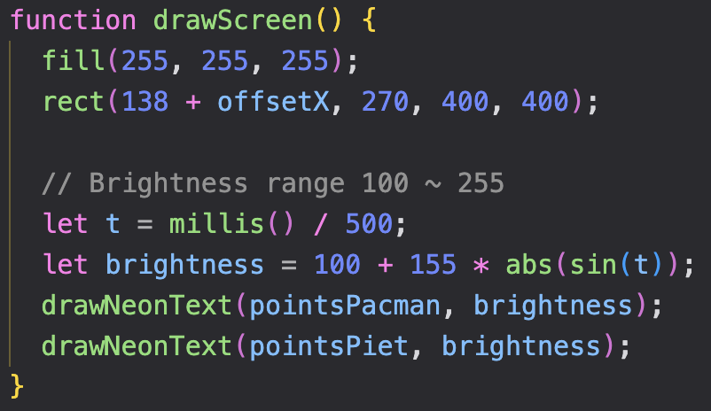
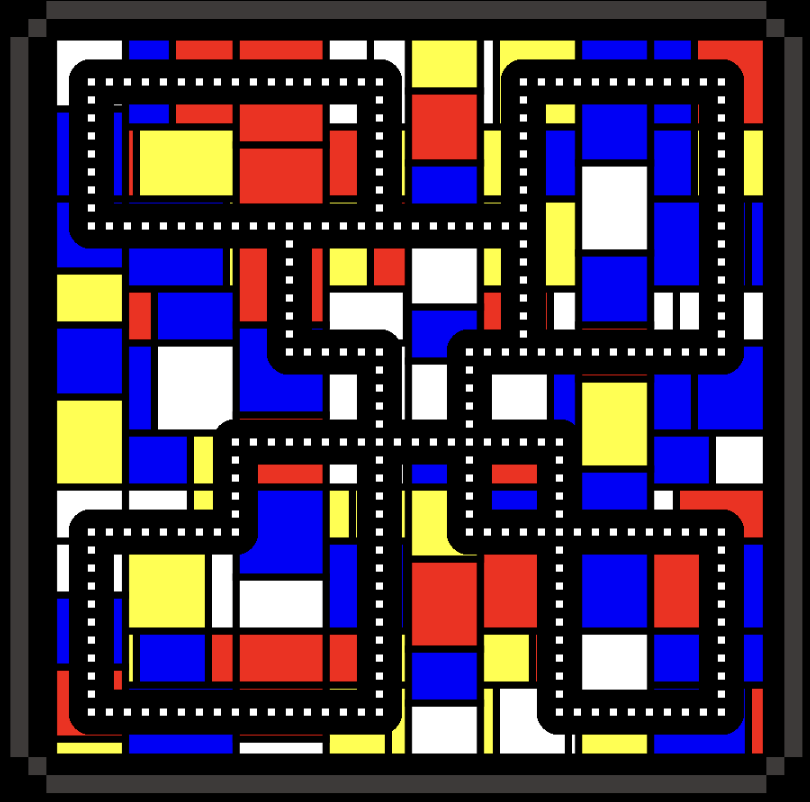
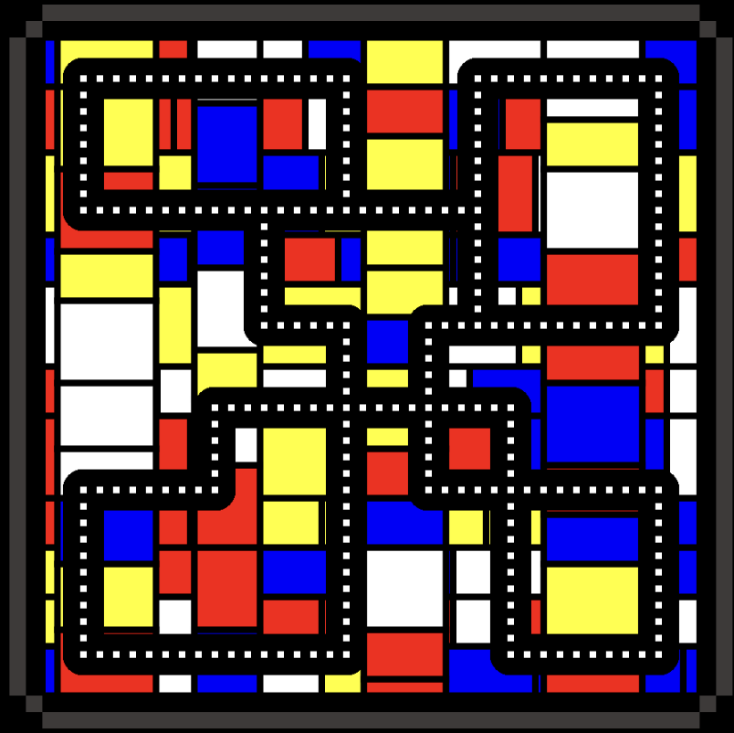
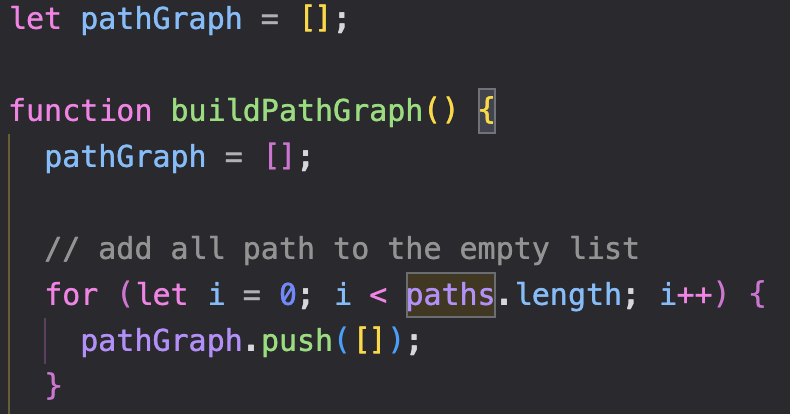
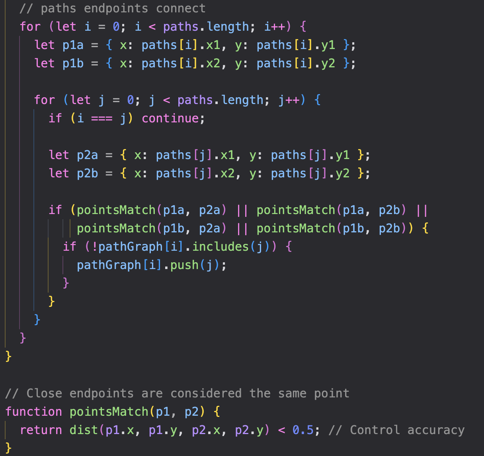
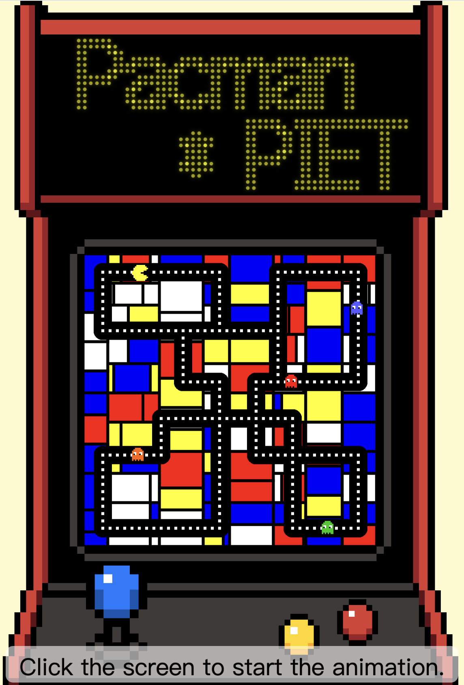
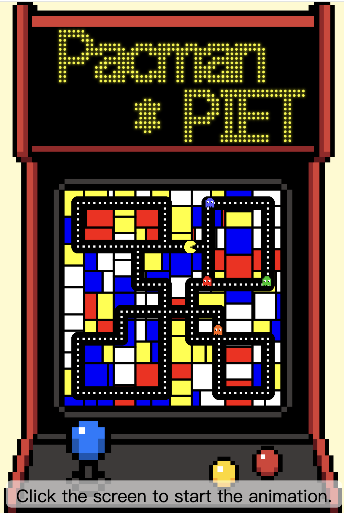

# Functioning prototype
This is **Somwrita-Group-J**'s personal Functioning prototype.  
I am responsible for the **Time-Based** part.
## Interactive Description of the Work
The system will load automatically when the page loads.  
At this point, users can immediately see the **neon light begin to flicker**, and the **background will automatically refresh** every 5 seconds.  
Users can **click the game console screen to start the animation**, and the game character will walk back and forth and turn within the path.  
**Clicking R** on the keyboard can reset the animation
|Completed results|System Technical Planning|
|-|-|
|  |  |  

## Details animating the group code
I am responsible for completing the **Time-Based** part of our group.   
Based on our static content, I want to add three effects to my personal project:
- **neon lights flashing over time,**
- **backgrounds refreshing over time,**
- **characters moving over time.**  

The following is a detailed description of the implementation of each part
### Neon Light
At this time, the neon light on the top of the game console will start flashing.  
I changed the original display mode to make the brightness change with the `millis()` function, achieving the effect of flickering light and dark.
|Result Plot|Code|
|-|-|
|  |  |

### Background Map
The background map of the game console will also refresh and change every 5 seconds over time.  
Here, I introduced a new function `regenerateBackground()`, reused the map generation method, and called it in the `draw()` function with a `setInterval(regenerateBackground, 5000);` to achieve timed refresh.
|background|background changed every 5000ms|
|-|-|
|  |  |

### Character movement over time
Currently we have one Pac-Man and four ghost characters.  
To make them move, we first need to plan their movement routes. In order to allow the characters to turn smoothly, I first need to make sure that these paths are not disconnected. So I created a new array `let pathGraph = [];`,At the same time, I paired it with a function `buildPathGraph()`, which adds the paths in the original `paths[]` array to the new array and ensures their connectivity.
|||
|-|-|
|  |  |

Secondly, in order to complete their movement, I created a new function `moveAlongPath(i)`. In this function, I asked it to choose a new road to go to at the intersection. At the beginning, I encountered the problem of *the character walking back and forth on the same road repeatedly*, so I added a **weighting** to increase the probability of the character turning at the corner.  
**Click the screen** and the character will start from the initial position and move along the path.
|The system starts running|After the system has been running for a period of time|
|-|-|
|  |  |

The Demo Video to this part:  [**Demo Video**](https://drive.google.com/file/d/1e-sKPwf5ghgLe0ypa5gi7JAMGtYhZVOr/view?usp=drive_link)

# Summary & Reflection
The above is my personal part of the Time-Based content effect. In this process, I tried to apply the `setInterval()` learned in class to control the changes of content over time. This process allowed me to learn a lot of other things, such as path judgment, direction selection, `millis()`, etc., which gave me a deeper understanding and practice of the creative code course.  
In future studies, the inspiration this course has given me will be lifelong and unforgettable. I will continue to learn and improve. I would like to thank you, my tutor, for your guidance this semester.

